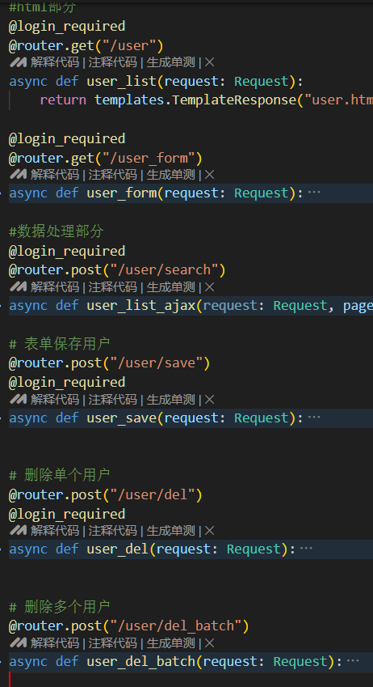
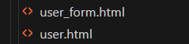

# 后台文件类型介绍

## 路由

路由是用来控制请求交给哪个函数处理的

在/admin/router.py配置

## 控制器

控制器是用来处理请求的。

位于/admin/controller/目录下。

对于一个数据表的控制器，我们需要处理表格页面，添加/编辑页面，获取表格数据请求，保存信息请求，删除请求。

## 模板

模板在/admin/templates/目录下。

对于一个数据表的模板，一般命名为 表名字.html 表名字_form.html

具体参考user的，二者继承自 table_base.html form_base.html

有时候填写的表单比较复杂，可以参考并询问ai关于  form_macros.html 的用法

里面封装了很多宏，你可以理解为一个函数

# 表格类开发流程

复制models文件夹,controller和template的一个例子,router.py，喂给gpt

让他帮你写

然后自己debug