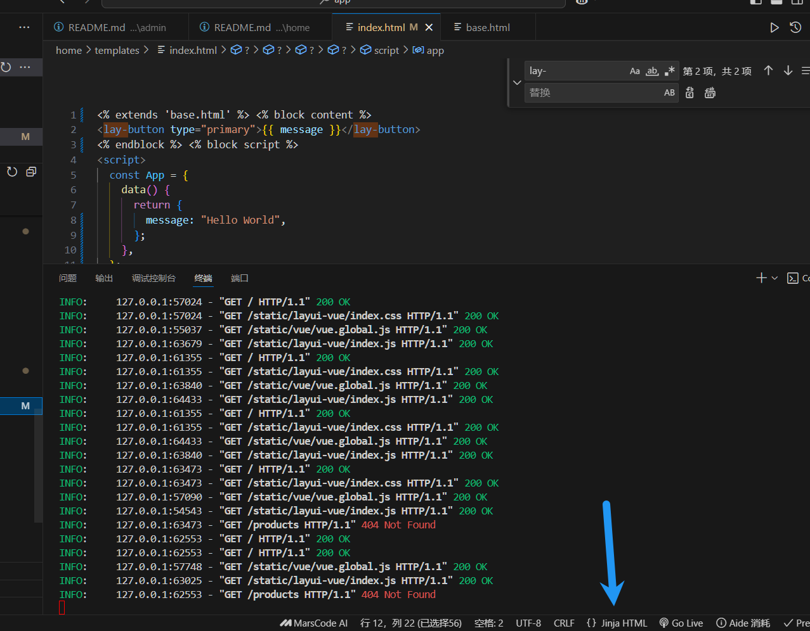

# 前台文件类型介绍

## 路由

路由是用来控制请求交给哪个函数处理的

在/home/router.py配置

## 控制器

控制器是用来处理请求的。

位于/home/controller/目录下。

## 模板

模板在/home/templates/目录下。

# 推荐插件

Better Jinja

然后在html下面选择jinja html 就可以正常格式化了(shift+alt+f)

