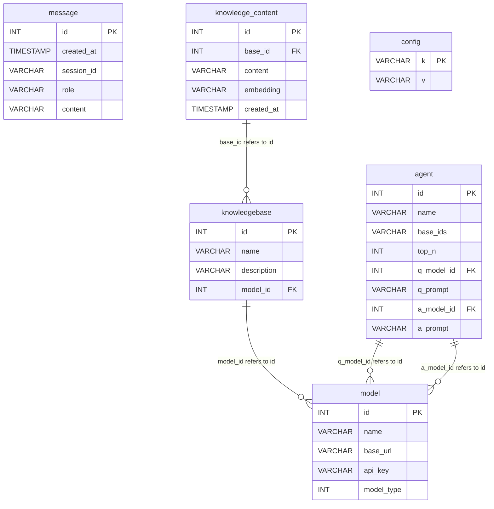

```mermaid
erDiagram
    message {
        INT id PK
        TIMESTAMP created_at
        VARCHAR session_id
        VARCHAR role
        VARCHAR content
    }
    model {
        INT id PK
        VARCHAR name
        VARCHAR base_url
        VARCHAR api_key
        INT model_type
    }
    knowledgebase {
        INT id PK
        VARCHAR name
        VARCHAR description
        INT model_id FK
    }
    knowledge_content {
        INT id PK
        INT base_id FK
        VARCHAR content
        VARCHAR embedding
        TIMESTAMP created_at
    }
    config {
        VARCHAR k PK
        VARCHAR v
    }
    agent {
        INT id PK
        VARCHAR name
        VARCHAR base_ids
        INT top_n
        INT q_model_id FK
        VARCHAR q_prompt
        INT a_model_id FK
        VARCHAR a_prompt
    }

    knowledgebase ||--o{ model : "model_id refers to id"
    knowledge_content ||--o{ knowledgebase : "base_id refers to id"
    agent ||--o{ model : "q_model_id refers to id"
    agent ||--o{ model : "a_model_id refers to id"

```