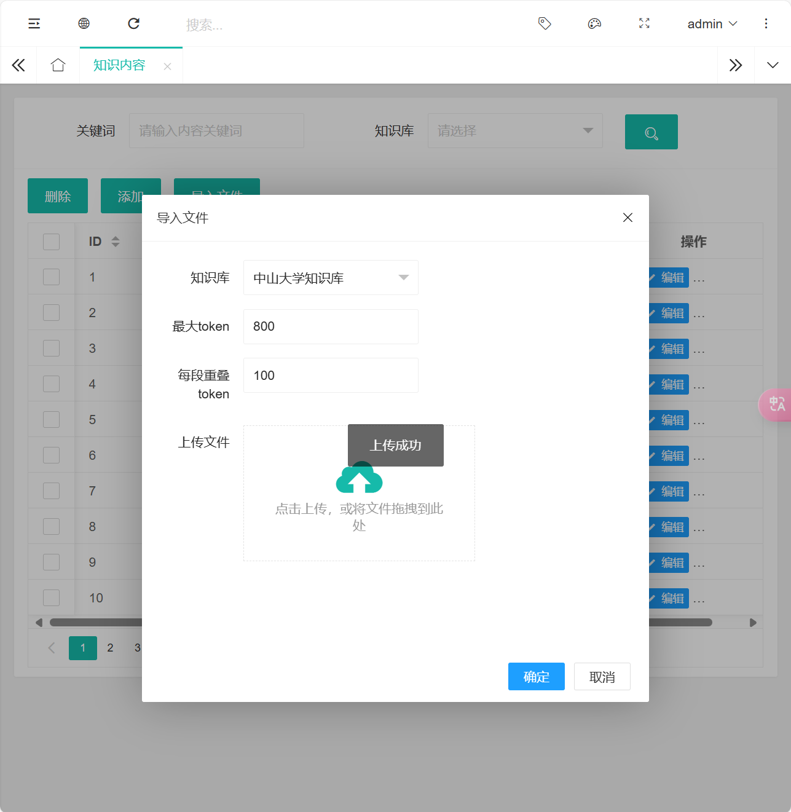

# AGENT-LLM

## 项目介绍

使用安装了`DataVec向量引擎插件`的`openGauss数据库`加上`非阻塞IO`开发的一套兼容OpenAI后端chat接口的RAG智能体平台,可以用于私有知识库智能大模型客服等项目.

利用RAG技术在某些方面可以代替微调大模型，训练私有知识并减少不必要的成本.

## 技术概览

### 数据库

使用安装了DataVec向量引擎插件的openGauss数据库

### 后端

- 基于Python fastapi开发,使用非阻塞式协程

- 用`psycopg3`协程链接数据库

- 封装统一`Model`接口对接数据表,减少重复sql撰写

- 通过`AsyncOpenAI`库链接兼容OpenAI接口的国产大模型平台`DeepSeek`,`智谱`

- 根据OpenAI接口规范,模拟出了他们的`chat`接口,方便任何支持对接OpenAI的项目使用我们API

### 前端

- 后台使用`LayuiAdmin`配合`Jinja2`模板引擎

- 前台使用Github上的`chatgpt-web`做了一定修改对接后端API,传递对话id

## 数据表介绍


### `message` 表

存储对话内容，包含以下字段：

- `id`: 主键，自增序列，唯一标识每条消息。
- `created_at`: 消息创建时间，默认值为当前时间。
- `session_id`: 对话会话ID，用于标识同一对话中的消息。
- `role`: 消息的角色，例如用户、系统、助手等。
- `content`: 消息内容，存储对话的具体文本。

### `model` 表

存储模型信息，包含以下字段：

- `id`: 主键，自增序列，唯一标识每个模型。
- `name`: 模型名称，用于标识模型的名称。
- `base_url`: 模型的基础URL，用于调用模型的API。
- `api_key`: 模型的API密钥，用于身份验证。
- `model_type`: 模型类型，标识模型是用于嵌入（0）还是对话（1）。

### `knowledgebase` 表

存储知识库信息，包含以下字段：

- `id`: 主键，自增序列，唯一标识每个知识库。
- `name`: 知识库名称，用于标识知识库的名称。
- `description`: 知识库描述，用于描述知识库的内容。
- `model_id`: 外键，引用 `model` 表的 `id`，标识知识库使用的模型。

### `knowledge_content` 表

存储知识库的内容，包含以下字段：

- `id`: 主键，自增序列，唯一标识每条知识内容。
- `base_id`: 外键，引用 `knowledgebase` 表的 `id`，标识该内容所属的知识库。
- `content`: 知识内容，存储具体的知识文本。
- `embedding`: 向量字段，存储知识内容的向量表示。
- `created_at`: 创建时间，默认值为当前时间。

### `config` 表

存储系统配置信息，包含以下字段：

- `k`: 配置键，主键，唯一标识每个配置项。
- `v`: 配置值，存储配置的具体值。

### `agent` 表

存储智能体信息，包含以下字段：

- `id`: 主键，自增序列，唯一标识每个智能体。
- `name`: 智能体名称，用于标识智能体的名称。
- `base_ids`: 知识库ID列表，标识智能体关联的知识库。
- `top_n`: 引用token上限，标识智能体在生成答案时引用的最大token数。
- `q_model_id`: 外键，引用 `model` 表的 `id`，标识用于问题优化的模型。
- `q_prompt`: 问题优化的提示，用于指导问题优化模型的输入。
- `a_model_id`: 外键，引用 `model` 表的 `id`，标识用于答案生成的模型。
- `a_prompt`: 答案生成的提示，用于指导答案生成模型的输入。

## 功能实现

### 前端对话

由于我们支持OpenAI格式接口，前端使用了Github开源的[chatgpt-web]程序，进行简单修改，方便直接选择后端设置好的`Agent`模型，并且自动生成`session_id`方便后端记录对话。

消息生成64位随机id

```js
let chat = { name: translations[locale]["newChatName"], data: [], session_id:generateRandomString(64) };
```

`body`注入`session_id`参数

```js
body = JSON.stringify({
    messages: dataSlice,
    model: currentModelName,
    stream: true,
    temperature: roleTemp,
    top_p: roleNature,
    session_id: session_id
});
```

模板引擎显示后台Agent，后台设置的API-key

```python
@home_router.get("/")
async def index(request: Request):
    agent_model = AgentModel()
    models = await agent_model.get_all()
    print(models)  # [{'id': 1, 'name': '中山大学助手'}]
    base_url = str(request.url).rstrip('/')

    config_model = ConfigModel()
    api_key = await config_model.get_config("api_key")
    return templates.TemplateResponse("index.html", {"request": request, "base_url": base_url, "models": models, "api_key":api_key})
```

```html
<!-- 模型选择列表，我们需要改为动态加载Agent -->
<div id="modelDialog" style="display:block;">
    
    <div class="modelSingle" data-value="{{ model.id }}">
        <div class="modelAvatar gptAvatar">
            <svg width="24" height="24">
                <use xlink:href="#aiIcon"></use>
            </svg>
        </div>
        <div>{{ model.name }}</div>
    </div>
    
</div>
```

```html
<div class="setContent setNotNormalFlow">
    <div class="setTitle"><span>base_url</span><span data-i18n-key="aiEndpoint"></span>
    </div>
    <div class="setDetail inputDetail" style="position: relative;">
        <input class="inputTextClass" placeholder="https://api.openai.com/"
            value="{{ base_url }}" autocomplete="off" id="apiHostInput" />
    </div>
</div>
<div class="setContent">
    <div class="setTitle"><span data-i18n-key="aiKey"></span></div>
    <div class="setDetail inputDetail">
        <input class="inputTextClass" type="password" placeholder="sk-xxxxxx"
            value="{{ api_key }}"
            id="keyInput" autocomplete="off" />
    </div>
</div>
```

效果展示：


### 后台表格增删改查

对于“增”和“改”的部分，实现的方法为`save`，“查”的部分实现方法为`search`，“删”的部分实现方法为`del`，下面以`knowledgebase`表为例，展示如何实现这些功能，其余控制器实现是类似的：

- 增（Create/Update） - `save`

```python
@router.post("/knowledgebase/save")
@login_required
async def knowledgebase_save(request: Request):
    form_data = await request.form()
    knowledgebase_model = KnowledgeBaseModel()

    knowledgebase_id = form_data.get("id")
    if knowledgebase_id:
        knowledgebase_id = int(knowledgebase_id)
    name = form_data.get("name")
    description = form_data.get("description")
    model_id = int(form_data.get("model_id", 0))

    if knowledgebase_id:
        data = {
            "name": name,
            "description": description,
            "model_id": model_id
        }
        await knowledgebase_model.update(knowledgebase_id, data)
        msg = "知识库更新成功"
    else:
        data = {
            "name": name,
            "description": description,
            "model_id": model_id
        }
        await knowledgebase_model.save(data)
        msg = "知识库创建成功"

    return ResponseModel(
        code=0,
        msg=msg
    )
```


- 查（Read） - `search`

```python
@router.post("/knowledgebase/search")
@login_required
async def knowledgebase_search(
    request: Request,
    page: int = Form(1),
    limit: int = Form(10),
    name: Optional[str] = Form(None)
):
    try:
        knowledgebase_model = KnowledgeBaseModel()
        conditions = {}
        if name:
            conditions["name"] = name
        paginated_data = await knowledgebase_model.get_paginated(page=page, per_page=limit, conditions=conditions)
        return ResponseModel(
            code=0,
            msg="Success",
            data=paginated_data["data"],
            count=paginated_data["total"]
        )
    except Exception as e:
        errmsg = f"{e} {traceback.format_exc()}"
        logging.error(errmsg)
        return ResponseModel(
            code=1,
            msg=errmsg,
            data=None
        )
```


- 删（Delete） - `del`

```python
@router.post("/knowledgebase/del")
@login_required
async def knowledgebase_del(request: Request):
    form_data = await request.form()
    knowledgebase_id = form_data.get("id")
    knowledgebase_model = KnowledgeBaseModel()

    if knowledgebase_id:
        await knowledgebase_model.delete(int(knowledgebase_id))
        return ResponseModel(
            code=0,
            msg="知识库删除成功"
        )
    return ResponseModel(
        code=1,
        msg="知识库 ID 不能为空"
    )
```


通过这些方法的实现，在后台可以对数据库表进行相应的操作

### Model模型封装

为了方便后台增删改查的实现，我们对每个表建立了模型类，继承自BaseModel，封装了数据库的增删改查操作。

```python
class BaseModel:
    table_name: str  # 子类需要定义表名

    def __init__(self):
        self.db_schema = settings.db_schema

    async def save(self, data: dict):
        """保存数据到表中"""
        async with db.pool.connection() as conn:
            async with conn.cursor(row_factory=psycopg.rows.dict_row) as cur:
                keys = ', '.join(data.keys())
                values = ', '.join([f"%({k})s" for k in data.keys()])
                sql = f'INSERT INTO "{self.db_schema}"."{self.table_name}" ({keys}) VALUES ({values}) RETURNING *'
                await cur.execute(sql, data)
                result = await cur.fetchone()
                return dict(result) if result else None

    async def update(self, id: int, data: dict):
        """更新表中的数据（参数化查询版）"""
        set_clause = ', '.join([f'"{k}" = %({k})s' for k in data.keys()])
        sql = f'UPDATE "{self.db_schema}"."{self.table_name}" SET {set_clause} WHERE id = %(id)s'
        data['id'] = id
        async with db.pool.connection() as conn:
            async with conn.cursor() as cur:
                await cur.execute(sql, data)
        return True

    async def delete(self, id: int):
        """删除表中的数据"""
        sql = f'DELETE FROM "{self.db_schema}"."{self.table_name}" WHERE id = %s'
        async with db.pool.connection() as conn:
            async with conn.cursor() as cur:
                await cur.execute(sql, (id,))
        return True

    async def batch_delete(self, ids: list):
        """批量删除表中的数据"""
        placeholders = ', '.join(['%s' for _ in ids])
        sql = f'DELETE FROM "{self.db_schema}"."{self.table_name}" WHERE id IN ({placeholders})'
        async with db.pool.connection() as conn:
            async with conn.cursor() as cur:
                await cur.execute(sql, ids)
        return True

    async def get_by_id(self, id: int):
        """根据ID获取单条记录"""
        sql = f'SELECT * FROM "{self.db_schema}"."{self.table_name}" WHERE id = %s'
        async with db.pool.connection() as conn:
            async with conn.cursor(row_factory=psycopg.rows.dict_row) as cur:
                await cur.execute(sql, (id,))
                result = await cur.fetchone()
                return dict(result) if result else None

    async def query(self, conditions: Optional[dict] = None, order_by: Optional[str] = None, limit: Optional[int] = None, offset: Optional[int] = None):
        """查询数据，支持多条件、排序、分页"""
        sql = f'SELECT * FROM "{self.db_schema}"."{self.table_name}"'
        params = {}
        if conditions:
            where_clause = ' AND '.join([f"{k} = %({k})s" for k in conditions.keys()])
            sql += f" WHERE {where_clause}"
            params.update(conditions)
        if order_by:
            sql += f" ORDER BY {order_by}"
        if limit:
            sql += f" LIMIT {limit}"
        if offset:
            sql += f" OFFSET {offset}"
        async with db.pool.connection() as conn:
            async with conn.cursor(row_factory=psycopg.rows.dict_row) as cur:
                await cur.execute(sql, params if params else None)
                results = await cur.fetchall()
                return [dict(row) for row in results]

    async def count(self, conditions: Optional[dict] = None):
        """获取数据总数"""
        sql = f'SELECT COUNT(*) FROM "{self.db_schema}"."{self.table_name}"'
        params = {}
        if conditions:
            where_clause = ' AND '.join([f"{k} = %({k})s" for k in conditions.keys()])
            sql += f" WHERE {where_clause}"
            params.update(conditions)
        async with db.pool.connection() as conn:
            async with conn.cursor(row_factory=psycopg.rows.dict_row) as cur:
                await cur.execute(sql, params if params else None)
                result = await cur.fetchone()
                if result:
                    return result['count']
                else:
                    return 0

    async def get_paginated(self, page: int = 1, per_page: int = 10, conditions: Optional[dict] = None):
        """获取分页数据"""
        offset = (page - 1) * per_page
        data = await self.query(conditions=conditions, limit=per_page, offset=offset)
        total = await self.count(conditions=conditions)
        return {
            "data": data,
            "total": total,
            "page": page,
            "per_page": per_page,
            "total_pages": (total // per_page) + (1 if total % per_page != 0 else 0)
        }

    async def get_map(self, source: str, target: str) -> dict:
        sql = f'SELECT "{source}", "{target}" FROM "{self.db_schema}"."{self.table_name}"'
        async with db.pool.connection() as conn:
            async with conn.cursor(row_factory=psycopg.rows.dict_row) as cur:
                await cur.execute(sql)
                results = await cur.fetchall()
                mapping = {row[source]: row[target] for row in results}
                return mapping

    async def get_options_list(self, value_field: str, label_field: str, conditions: Optional[dict] = None):
        """获取选项列表，格式为 [{value: ..., label: ...}, ...]"""
        sql = f'SELECT "{value_field}" AS value, "{label_field}" AS label FROM "{self.db_schema}"."{self.table_name}"'
        params = {}
        if conditions:
            where_clause = ' AND '.join([f"{k} = %({k})s" for k in conditions.keys()])
            sql += f" WHERE {where_clause}"
            params.update(conditions)
        async with db.pool.connection() as conn:
            async with conn.cursor(row_factory=psycopg.rows.dict_row) as cur:
                await cur.execute(sql, params if params else None)
                results = await cur.fetchall()
                return [dict(row) for row in results]

    # 事务管理示例
    async def begin_transaction(self):
        """手动开启事务"""
        self.transaction = self.pool.transaction()
        await self.transaction.__aenter__()

    async def commit_transaction(self):
        """提交事务"""
        await self.transaction.__aexit__(None, None, None)

    async def rollback_transaction(self):
        """回滚事务"""
        await self.transaction.__aexit__(Exception("Rollback"), None, None)
```

BaseModel实现了基本的分页查找，根据id查找，插入，保存，批量删除等操作。

其余类继承自BaseModel，并可能封装一些额外的便捷查询函数。

以`KnowledgeBaseModel`为例子，额外封装了根据知识库id查询关联的模型信息。

```python
class KnowledgeBaseModel(BaseModel):
    table_name = "knowledgebase"

    async def get_model_details_by_base_id(self, base_id: int) -> dict:
        sql = f'''
            SELECT m.name AS model, m.base_url, m.api_key
            FROM "{self.db_schema}".knowledgebase kb
            JOIN "{self.db_schema}".model m ON kb.model_id = m.id
            WHERE kb.id = %s
        '''
        async with db.pool.connection() as conn:
            async with conn.cursor(row_factory=psycopg.rows.dict_row) as cur:
                await cur.execute(sql, (base_id,))
                result = await cur.fetchone()
                if not result:
                    return {}
                return {
                    "model": result['model'],
                    "base_url": result['base_url'],
                    "api_key": result['api_key']
                }
```

其余Model与其类似，在此不再赘述。

比较特殊的是ConfigModel，仅仅存储键值对，类似于一个哈希表。用来存储管理员账号密码，前台调用apikey这种简单信息。

```python
import psycopg
from typing import Optional, Dict
from database import db
from config import settings
import logging
class ConfigModel:
    table_name = "config"

    def __init__(self):
        self.db_schema = settings.db_schema

    async def save(self, data: dict) -> Optional[Dict]:
        """保存数据到表中"""
        keys = ', '.join(data.keys())
        values = ', '.join([f"%({k})s" for k in data.keys()])
        sql = f'INSERT INTO "{self.db_schema}"."{self.table_name}" ({keys}) VALUES ({values}) RETURNING *'
        async with db.pool.connection() as conn:
            async with conn.cursor(row_factory=psycopg.rows.dict_row) as cur:
                try:
                    await cur.execute(sql, data)
                    result = await cur.fetchone()
                    await conn.commit()
                    return dict(result) if result else None
                except Exception as e:
                    await conn.rollback()
                    logging.error(f"保存配置时出错: {e}")
                    return None

    async def update(self, id: int, data: dict) -> bool:
        """更新表中的数据"""
        set_clause = ', '.join([f'"{k}" = %({k})s' for k in data.keys()])
        sql = f'UPDATE "{self.db_schema}"."{self.table_name}" SET {set_clause} WHERE id = %(id)s'
        data['id'] = id
        async with db.pool.connection() as conn:
            async with conn.cursor() as cur:
                try:
                    await cur.execute(sql, data)
                    await conn.commit()
                    return True
                except Exception as e:
                    await conn.rollback()
                    logging.error(f"更新配置时出错: {e}")
                    return False

    async def create_config(self, k: str, v: str) -> Optional[Dict]:
        """创建新的配置"""
        data = {
            "k": k,
            "v": v
        }
        return await self.save(data)

    async def get_config(self, k: str) -> Optional[str]:
        """根据键获取配置值"""
        sql = f'SELECT v FROM "{self.db_schema}"."{self.table_name}" WHERE k = %s'
        async with db.pool.connection() as conn:
            async with conn.cursor(row_factory=psycopg.rows.dict_row) as cur:
                try:
                    await cur.execute(sql, (k,))
                    res = await cur.fetchone()
                    return res['v'] if res else None
                except Exception as e:
                    logging.error(f"获取配置时出错: {e}")
                    return None

    async def get_all_configs(self) -> Dict[str, str]:
        """获取所有配置为字典"""
        sql = f'SELECT k, v FROM "{self.db_schema}"."{self.table_name}"'
        async with db.pool.connection() as conn:
            async with conn.cursor(row_factory=psycopg.rows.dict_row) as cur:
                try:
                    await cur.execute(sql)
                    results = await cur.fetchall()
                    config_dict = {row['k']: row['v'] for row in results}
                    return config_dict
                except Exception as e:
                    logging.error(f"获取所有配置时出错: {e}")
                    return {}

    async def save_configs(self, configs: Dict[str, str]) -> bool:
        """保存配置字典，存在则更新，不存在则新增"""
        async with db.pool.connection() as conn:
            async with conn.cursor() as cur:
                try:
                    for k, v in configs.items():
                        existing = await self.get_config(k)
                        if existing is not None:
                            sql = f'UPDATE "{self.db_schema}"."{self.table_name}" SET v = %s WHERE k = %s'
                            await cur.execute(sql, (v, k))
                        else:
                            sql = f'INSERT INTO "{self.db_schema}"."{self.table_name}" (k, v) VALUES (%s, %s)'
                            await cur.execute(sql, (k, v))
                    await conn.commit()
                    return True
                except Exception as e:
                    await conn.rollback()
                    logging.error(f"保存配置字典时出错: {e}")
                    return False

    async def delete_config(self, k: str) -> bool:
        """删除配置"""
        sql = f'DELETE FROM "{self.db_schema}"."{self.table_name}" WHERE k = %s'
        async with db.pool.connection() as conn:
            async with conn.cursor() as cur:
                try:
                    await cur.execute(sql, (k,))
                    await conn.commit()
                    return True
                except Exception as e:
                    await conn.rollback()
                    logging.error(f"删除配置时出错: {e}")
                    return False

    async def update_config(self, k: str, v: str, cur: Optional[psycopg.AsyncCursor] = None) -> bool:
        """更新配置"""
        sql = f'UPDATE "{self.db_schema}"."{self.table_name}" SET v = %s WHERE k = %s'
        if cur:
            try:
                await cur.execute(sql, (v, k))
                return True
            except Exception as e:
                logging.error(f"更新配置时出错: {e}")
                return False
        else:
            async with db.pool.connection() as conn:
                async with conn.cursor() as cur_inner:
                    try:
                        await cur_inner.execute(sql, (v, k))
                        await conn.commit()
                        return True
                    except Exception as e:
                        await conn.rollback()
                        logging.error(f"更新配置时出错: {e}")
                        return False

    async def __aenter__(self):
        """异步上下文管理器入口"""
        return self

    async def __aexit__(self, exc_type, exc, tb):
        """异步上下文管理器退出"""
        pass
```

### 知识上传

知识的上传导入功能主要包含以下方法：

- 文件上传
  - 路由：/knowledgecontent_upload
  - 功能：处理用户上传的文件，并将文件保存到指定的目录中
  - 具体实现如下：
```python
@router.post("/knowledgecontent_upload")
@login_required
async def knowledgecontent_upload(request: Request, file: UploadFile = File(...)):
    try:
        upload_folder = os.path.join("app", "upload")
        os.makedirs(upload_folder, exist_ok=True)
        file_path = os.path.join(upload_folder, file.filename)

        with open(file_path, "wb") as buffer:
            shutil.copyfileobj(file.file, buffer)

        return ResponseModel(code=0, msg=file_path)
    except Exception as e:
        return ResponseModel(code=1, msg=f"文件处理失败：{str(e)}")
```

- 文件导入
  - 路由：/knowledgecontent_import
  - 功能：处理用户提交的导入任务，包括文件路径、知识库ID、最大长度和重叠量等参数
  - 具体实现如下：
```python
@router.post("/knowledgecontent_import")
@login_required
async def knowledgecontent_import_post(
    request: Request,
    base_id: int = Form(...),
    max_len: int = Form(...),
    over_leap: int = Form(...),
    file_path: Optional[str] = Form(None),
):
    asyncio.create_task(process_import_task(base_id, max_len, over_leap, file_path))
    return ResponseModel(code=0, msg="成功")
```

- 导入任务处理
  - 函数：process_import_task
  - 根据文件类型（.md、.txt、.json）对文件内容进行拆分，并将拆分后的内容保存到知识库中
  - 具体实现如下：
```python
async def process_import_task(base_id: int, max_len: int, over_leap: int, file_path: Optional[str]):
    knowledegebase_model = KnowledgeBaseModel()
    content_model = KnowledgeContentModel()
    embedding_model = await knowledegebase_model.get_model_details_by_base_id(base_id)
    ext = os.path.splitext(file_path)[1]
    if not file_path:
        res = []
        print("文件路径为空")
        return
    if ext == ".md" or ext == ".txt":
        res = split_md(file_path, max_len, over_leap)
    elif ext == ".json":
        res = split_json(file_path, max_len, over_leap)
    aiApi = ai(embedding_model['api_key'], embedding_model['base_url'])
    model_name = embedding_model['model']
    for context in res:
        embedding = await aiApi.embedding(model_name, context)
        data = {
            "base_id": base_id,
            "content": context,
            "embedding": embedding,
        }
        await content_model.save(data)
    print("Import task completed")
```

- 文件内容拆分
  - 函数：split_md 和 split_json
  - 功能：分别处理 Markdown 文件和 JSON 文件的内容拆分
  - 具体实现如下：
```python
def split_md(file_path: str, max_len: int, over_leap: int) -> List[str]:
    documents = load_markdown_to_documents(file_path)
    split_texts = split_documents_by_token(documents, chunk_size=max_len, chunk_overlap=over_leap)
    return split_texts

def split_json(file_path: str, max_len: int, over_leap: int) -> List[str]:
    res = []
    with open(file_path, "r", encoding="utf-8") as file:
        data = json.load(file)
    for item in data:
        question = item.get("question", "")
        answer = item.get("answer", "")
        merged_text = f"问题：{question}\n答案：{answer}"
        res.append(merged_text)
    return res
```

知识上传导入功能主要包括文件上传、文件导入任务的提交、导入任务的异步处理以及文件内容的拆分和保存，通过这些功能，管理员可以在后台将外部文件中的知识内容导入到系统中，并自动生成嵌入向量，以便后续的知识检索和应用



### RAG搜索

### 模拟OpenAI对话接口

- 考虑到OpenAI的API规范已经被业界各种软件包广泛支持兼容，我们只需要实现对应的接口就可以方便被各种程序调用


#### 请求参数

- 以下类被用于规范请求参数，一个Chat请求主要包含消息列表和一些额外参数（温度，流传输，最大token数等）

```python
class ContentItem(BaseModel):
    type: str  # 内容类型，例如 "text"
    text: str  # 实际的内容

class Message(BaseModel):
    role: str
    content: Union[str, List[ContentItem]]  # 支持字符串或复杂的内容结构

class ChatRequest(BaseModel):
    model: str
    messages: List[Message]
    stream: Optional[bool] = False
    temperature: Optional[float] = 1.0
    max_tokens: Optional[int] = None
    session_id: Optional[str] = None
```

#### 回复参数

- 以下类被用于回复格式：包括token消耗，回复消息内容

```python
class Usage(BaseModel):
    prompt_tokens: int = 0
    completion_tokens: int = 0
    total_tokens: int = 0

class ChoiceMessage(BaseModel):
    role: str
    content: Optional[str] = None

class Choice(BaseModel):
    index: int
    message: ChoiceMessage
    finish_reason: Optional[str] = None

class ChatCompletionResponse(BaseModel):
    id: str
    object: str = "chat.completion"
    created: int
    choices: List[Choice]
    usage: Usage
```

#### 非流传输模式

在非流传输模式下，整个对话请求会在一次请求中完成，服务器会等待AI模型生成完整的回复后再返回给客户端。具体实现步骤如下：

1. 接收并解析请求参数。
2. 验证请求头中的API Key。
3. 根据请求参数和模型配置，准备对话消息。
4. 调用AI模型生成回复。
5. 记录AI回复消息。
6. 返回完整的回复给客户端。

代码示例：

```python
response_text = await chat_client.chat(model=a_model['name'], messages=messages, stream=False)
openai_response = ChatCompletionResponse(
    id=f"chatcmpl-{int(time.time())}",
    created=int(time.time()),
    choices=[Choice(index=0, message=ChoiceMessage(role="assistant", content=response_text), finish_reason="stop")],
    usage=Usage(prompt_tokens=0, completion_tokens=len(response_text.split()), total_tokens=len(response_text.split()))
)
return JSONResponse(content=openai_response.dict())
```

#### 流传输模式

在流传输模式下，服务器会逐步生成并发送回复内容，客户端可以实时接收并显示部分回复。这种模式适用于需要即时反馈的场景。具体实现步骤如下：

1. 接收并解析请求参数。
2. 验证请求头中的API Key。
3. 根据请求参数和模型配置，准备对话消息。
4. 初始化流传输生成器，逐步生成并发送回复内容。
5. 记录AI回复消息。
6. 发送结束标记，表示回复完成。

代码示例：

```python
async def event_generator():
    collected_response = ""
    async for chunk in (await chat_client.chat(model=a_model['name'], messages=messages, stream=True)):
        delta_content = chunk.strip()
        collected_response += delta_content
        response = {
            "id": f"chatcmpl-{int(time.time())}",
            "object": "chat.completion.chunk",
            "created": int(time.time()),
            "model": a_model['name'],
            "choices": [{
                "index": 0,
                "delta": {"content": delta_content}
            }],
        }
        yield f"data: {json.dumps(response)}\n\n"
    response = {
        "id": f"chatcmpl-{int(time.time())}",
        "object": "chat.completion.chunk",
        "created": int(time.time()),
        "model": a_model['name'],
        "choices": [{
            "index": 0,
            "delta": {},
            "finish_reason": "stop"
        }],
    }
    yield f"data: {json.dumps(response)}\n\n"
    yield f"data: [DONE]\n\n"

return StreamingResponse(event_generator(), media_type="text/event-stream")
```

### RAG搜索

> RAG搜索模块融合在模拟OpenAI对话接口中

#### 问题优化

在上下文比较长的时候，往往出现指代不明等情况，所以需要单独用大模型去优化用户的问题。

优化的多个问题再去搜素，往往可以提高命中率。

使用下面代码实现，代码中同时包含了几个提供AI参考的例子，方便deepseek参考给出答案，同时实现了提取JSON格式输出，方便python处理

```python
async def questions_optimization(client: ai, model: str, messages: list, q_prompt: str = None) -> list:
    start_time = time.time()
    system_prompt = f"""接下来请帮忙对问题扩展，扩展问题到1-3个，便于知识库搜索。
如果用户消息带有历史记录，你需要帮忙做指代消除。
背景知识：{q_prompt}""" + """
案例
示例 1
EXAMPLE INPUT: 艾菲尔铁塔在哪
EXAMPLE JSON OUTPUT:
{
    "questions": [
        {
            "question": "艾菲尔铁塔的位置"
        },
        {
            "question": "艾菲尔铁塔的地址"
        }
    ]
}

示例 2
EXAMPLE INPUT: 怎么去机场
EXAMPLE JSON OUTPUT:
{
    "questions": [
        {
            "question": "去机场的路线"
        },
        {
            "question": "到达机场的步骤"
        }
    ]
}
示例 3:指代消除
EXAMPLE History: 蔡徐坤是明星吗?
EXAMPLE INPUT: 他最近在哪里演出
EXAMPLE JSON OUTPUT:
{
    "questions": [
        {
            "question": "蔡徐坤最近演出地点"
        },
        {
            "question": "蔡徐坤演出时间"
        }
    ]
}

现在请结合用户的历史聊天记录对当前问题进行修改扩充
"""
    user_prompt = messages[-1]['content']
    history = messages[:-1]
    result = await client.extract_json(model, system_prompt, user_prompt, history)
    end_time = time.time()
    logging.info(f"问题优化耗时: {end_time - start_time}秒")
    return result
```

#### 知识查询

在得到优化后的多个问题之后，可以在向量数据库中查找。

下面函数使用了for循环先Embedding每一个查找问题，再for循环查找TopN的相似结果。

由于使用了协程`await`，在for循环等到一个查询的时候触发了`IO阻塞`，会自动查询下一个问题，大幅度提高了查询效率。在代码格式简单的情况下等价于多线程查询。

```python
async def get_knowledges(base_ids: list, questions: list, top_n: int) -> list:
    start_time = time.time()
    base_model = KnowledgeBaseModel()
    content_model = KnowledgeContentModel()
    embedding_model = await base_model.get_model_details_by_base_id(base_ids[0])
    embedApi = ai(embedding_model['api_key'], embedding_model['base_url'])
    embedding_list = []
    # 得到多个问题的embedding
    for question in questions:
        embedding = await embedApi.embedding(embedding_model['model'], question)
        embedding_list.append(embedding)
    # 对每个base_id，用每个embedding去搜索
    res = []
    for embedding in embedding_list:
        contents = await content_model.get_nearest_neighbors(embedding, top_n=top_n, base_ids=base_ids)
        # 确保 contents 中的每个元素都是字符串类型
        contents = [content['content'] for content in contents]
        res.extend(contents)
    end_time = time.time()
    logging.info(f"向量搜索耗时: {end_time - start_time}秒")
    return res
```

#### 邻近知识搜索

该函数实现了调用向量数据库DataVec的`sql`封装，实现了对向量数据库的搜索。

```python
async def get_nearest_neighbors(self, embedding: List[float], top_n: int = 5, base_ids: Optional[List[int]] = None):
    embedding_str = list_to_vector(embedding)
    sql = f'SELECT id, content FROM "{self.db_schema}"."{self.table_name}"'
    if base_ids:
        base_ids_str = ', '.join(map(str, base_ids))
        sql += f' WHERE base_id IN ({base_ids_str})'
    sql += f' ORDER BY embedding <-> %s LIMIT %s'
    async with db.pool.connection() as conn:
        async with conn.cursor(row_factory=psycopg.rows.dict_row) as cur:
            await cur.execute(sql, (embedding_str, top_n))
            return await cur.fetchall()
```

#### 答案注入提示

使用简单的变量拼接即可把刚刚的结果插入大模型提示词中，便于大模型回答。

```python
messages[-1]['content'] = f"{a_prompt}\n\n使用下面<data></data>的知识辅助回答问题,该结果来源于用户问题经过优化后的问题在知识库搜索" \
            f"<data>{knowledges_text}</data>\n用户问题:\n'''{origin_question}'''\n优化后的问题是:{questions_str}"
```

## 特别鸣谢

以下排名不分先后

- OpenGauss [https://docs.opengauss.org/zh/docs/latest/docs/AboutopenGauss/DataVec%E5%90%91%E9%87%8F%E5%BC%95%E6%93%8E.html](https://docs.opengauss.org/zh/docs/latest/docs/AboutopenGauss/DataVec%E5%90%91%E9%87%8F%E5%BC%95%E6%93%8E.html)

- Layui组件库  [https://layui.dev/](https://layui.dev/)

- FastApi [https://fastapi.tiangolo.com/zh/](https://fastapi.tiangolo.com/zh/)

- chatgpt-web [https://github.com/xqdoo00o/chatgpt-web](https://github.com/xqdoo00o/chatgpt-web)

- deepseek [https://platform.deepseek.com/](https://platform.deepseek.com/)

- 智谱AI [https://bigmodel.cn/](https://bigmodel.cn/)
